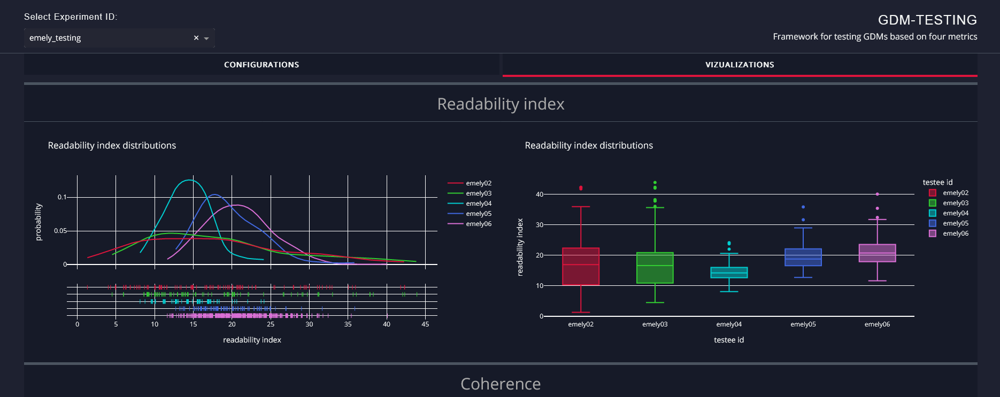
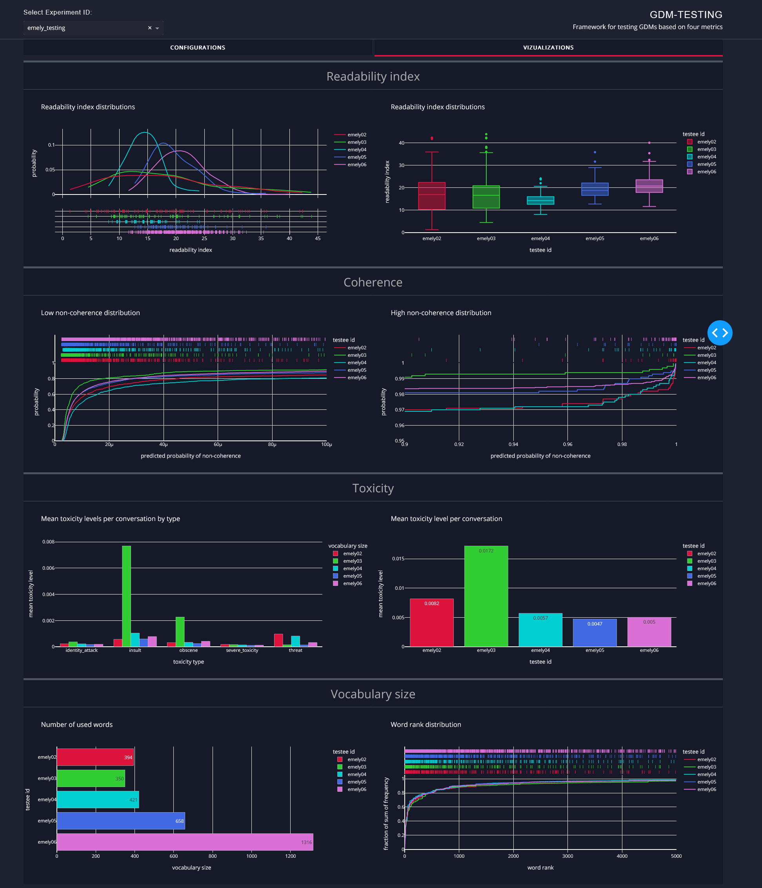
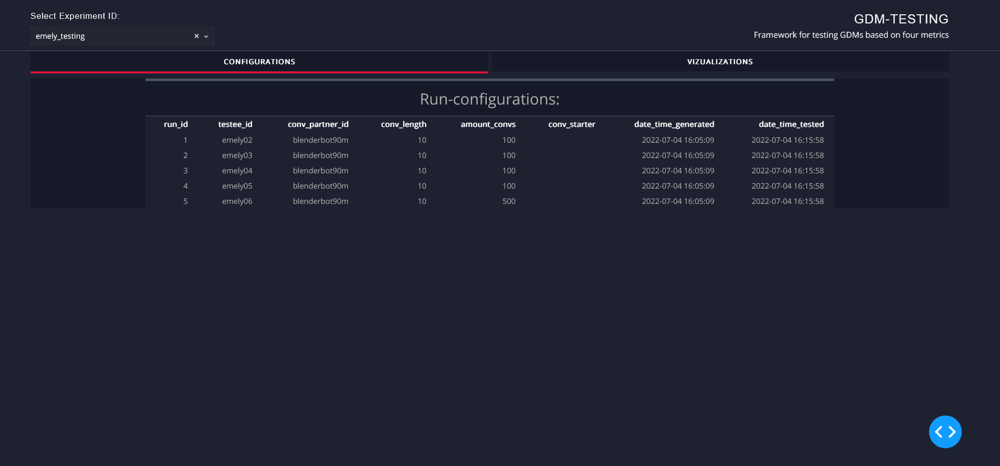

# Generative Dialogue Model Automated Quality Assurance Tool



## Description

This repository contains a framework for testing and evaluating GDMs. The visualizations in this readme shows results from testing different versions of the GDM named Emely adapted for interviews.

There are two steps in ```main.py```:

1. Generating conversations.
- We divide the output into experiments with unique experiment ids.
- Each experiment contains a number of runs with numerical ids.
- Generated conversations are stored in ```test_data/{EXPERIMENT_ID}/run_{RUN_ID}.txt```
- The configurations for all runs in an experiment are stored in ```test_data/{EXPERIMENT_ID}/experiment_config.json```

2. Analyzing the conversations.
- Test results are stored in an SQL-database in ```test_results/{EXPERIMENT_ID}.sqlite```
- The configuration for each run is contained in the table ```runs```
- Each test-case is then imported into a separate table each.
- If we want to analyze conversations that have already been generated we can use the argument ```--read-run-ids``` to read these from the chosen .txt-files determined by the run_id.


## How to run

Install dependencies

```
# clone project
git clone git@github.com:NordAxon/GDM-testing.git

# install project
cd GDM-testing
pip install -e .
pip install -r requirements.txt -f https://download.pytorch.org/whl/torch_stable.html
```

Testing is run by:

```
# run module
python main.py <OPTIONS> [PARAMETERS]
```

Run `python main.py -h` to have the options presented, or see below:

```
# options available
usage: main.py [-h] [-eid EXPERIMENT_ID] [-v] [-ec] [-od] [-cl] [-cs] [-rcs RANDOM_CONV_START] [-a] [-cp] [-t] [-im] [-rid]

Parser for setting up the script as you want

optional arguments:
  -h, --help                show this help message and exit
  -eid, --experiment_id     We divide all runs into experiments with a unique identifier.
  -v, --verbose             Use verbose printing.
  -ec , --export-channel    Specify which channel to export the results through. Currently only 'sqlite' is available.
  -od, --overwrite-db       Specifies if the result database should be overwritten during computation.
  -cl , --conv-length       How many replies from each GDM all conversations should contain.
  -cs , --conv-starter      Testee: testee initiates every conversation.
                            Conv-partner: the conversation partner initiates all conversations. Not specified: 50-50.
  -rcs, --random-conv-start Start conversations with a random reply.
  -a , --amount-convs       How many conversations shall there be per tested GDM.
  -cp , --conv-partner_id   Specify which GDM to run your testees against.
  -t , --testee-ids         Names of local docker images to use for each run, separated by ",".
  -im, --interview-mode     Conversations are initialized as interview scenarios.
  -rid , --read-run-ids     Run ids of the runs to import.
                            No input is interpreted as such the script generates conversations using the GDMs.
                            Currently only miscellaneous .txt-files are supported.
```

### Visualise the results using Dash

1. Run ```python dashboard.py```
2. If experiment results exist you can choose between experiments in the dropdown to the top left.
3. The graphs are shown in the right tab:



4. The run-configurations are shown in the left tab:



5. To add your own graphs implement this in ```visualization/graphs.py```.

### Citation

```
@article{JohanBengtsson2022,
  title={Quality Measurement of Generative Dialogue Models for Language Practice},
  author={Johan Bengtsson},
  year={2022}
}
```

